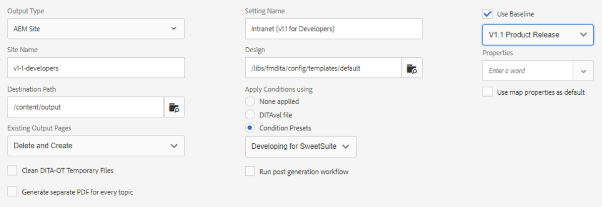

# Output Presets

An Output Preset is a collection of publishing properties that have been assigned to a map. These can be created or modified if needed.

>[!VIDEO](https://video.tv.adobe.com/v/338989)

## Accessing Output Presets

An output preset is shown when a map in the XML Editor is opened in the Map Dashboard. Presets may include information about a specific output type, destination path, instructions on how to manage existing output pages, and other settings that can be applied to a map to generate output.

 
## Creating an Output Preset

>[!NOTE]
>
>NOTE: Some of the features used by an output preset may be dependent on first developing a baseline or a condition preset. If these are required you must configure them using the appropriate tabs.

1. Select a baseline output preset. For example, AEM or PDF could be selected if the new preset to create is for a site or to provide Adobe PDF content.

2. Click **Create**.

3. If required, select an Output Type.

4. Based on the output type further configure the options.

5. Click **Done**.

## Edit an Output Preset

Output presets are predefined but can be customized as needed.

1. Open the Map Dashboard.

2. Select the **Output Presets** tab.

3. Select an output preset.

4. Click **Edit**.

5. Modify the settings as required.

    
 
6. Click **Done**.
